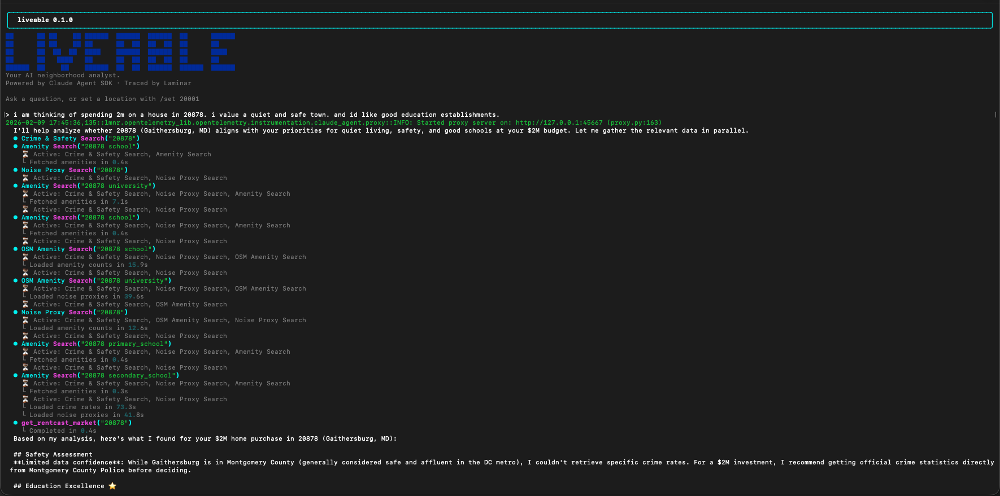

# Liveable



Liveable is a Python CLI assistant that takes a US ZIP code and answers neighborhood questions conversationally. It uses the Claude Agent SDK with Laminar observability instrumentation and custom MCP tools for each data source.

## Features
- Claude Agent SDK orchestration + MCP tools
- Laminar tracing for every tool call and synthesis step
- Google Places, Census ACS, Walk Score, RentCast, HUD FMR, Overpass, and web crime search integrations
- Conversational REPL with tool-backed answers

## Requirements
- Python 3.10+
- Anthropic API key (`ANTHROPIC_API_KEY`)
- Laminar project API key (`LMNR_PROJECT_API_KEY`)
- Optional: Google Places, Census, Walk Score, RentCast, HUD FMR, and Browser Use API keys

## Setup
```bash
python -m venv .venv
source .venv/bin/activate
pip install -e .
```

Create a `.env` file from `.env.example` and fill in the values.

## Running
```bash
python -m liveable
```

Ask questions interactively. Use `/set 20001` to load a location or include a ZIP in your question. Type `exit` to quit.

Compare two locations:
```
/compare 20001 20878
```

## API Keys & Environment Variables
| Variable | Required | Purpose | Get a key |
| --- | --- | --- | --- |
| `ANTHROPIC_API_KEY` | Yes | Claude Agent SDK | https://console.anthropic.com/ |
| `LMNR_PROJECT_API_KEY` | Yes | Laminar tracing | https://www.lmnr.ai/ |
| `GOOGLE_PLACES_API_KEY` | No | Google Places (ratings/quality) | https://console.cloud.google.com/apis/credentials |
| `CENSUS_API_KEY` | No | Census ACS demographics | https://api.census.gov/data/key_signup.html |
| `WALKSCORE_API_KEY` | No | Walk Score API | https://www.walkscore.com/professional/api-sign-up.php |
| `RENTCAST_API_KEY` | No | RentCast sales/listings + market stats | https://www.rentcast.io/api |
| `HUD_API_KEY` | No | HUD Fair Market Rent data | https://www.huduser.gov/portal/datasets/hudapi.html |
| `BROWSER_USE_API_KEY` | No | Browser Use Cloud (crime web search) | https://cloud.browser-use.com |
| `OVERPASS_URL` | No | Overpass endpoint override | https://overpass.private.coffee/api/interpreter |
| `DEV_PERMITS_BASE_URL` | No | Open-data permits/development endpoint | n/a |
| `DEV_PERMITS_QUERY` | No | Query template for permits filtering | n/a |
| `CLAUDE_MODEL` | No | Override model (default `claude-sonnet-4-20250514`) | n/a |
| `LIVEABLE_USER_ID` | No | Laminar trace user id | n/a |
| `LMNR_TRACE_BASE_URL` | No | Override trace base URL | n/a |

## Notes
- If any data source fails, the agent will note reduced confidence in its answers.
- Development pipeline data requires an open-data endpoint; set `DEV_PERMITS_BASE_URL` to enable it.

## License
MIT. See `LICENSE`.
